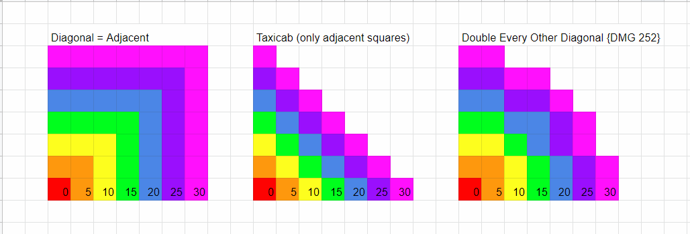

# IRONWARS - HUNGER GAMES

## Intro
Serán 5 personajes diferentes con habilidades mejoradas en función de su clase (profesión). La idea es que todos los personajes independientemente de su clase puedan hacer de todo, pero el que mejor curará será el Healer y el que más daño haga a distancia será el Archer. 

## Characters

### Base
#### Habilidades Pasivas
Las habilidades pasivas tienen efecto durante todo el tiempo y afectan al estado del personaje. 
- hit points
- dodge
- regeneration
- stealth
- movement
#### Habilidades Activas
Las habilidades activas se ejecutan UNA vez por turno y es lo último que realiza el personaje en el turno actual. 
- melee attack
- range attack
- heal
- seeing
- traps
- coger equipo
### Warrior

- hit points
- melee attack

### Archer

- dodge
- range attack

### Healer

- regeneration
- heal

### Ranger

- movement
- traps

### Rogue

- stealth
- seeing

## Skills
* **hit points**: puntos de vida. cuando llegan a 0 se muere
* **melee attack**: daño en ataques cuerpo a cuerpo
* **dodge**: % daño que reduce de cada ataque
* **range attack**: año en ataques a distancia
* **regeneration**: puntos de vida que regenera cada asalto
* **heal**: puntos de vida que puede hacer recuperar a un personaje contiguo (y a si mismo) mediante el uso de un kit médico en su inventario. 
* **stealth**: distancia a la que es visto, cuanto más baja más sigiloso es puesto que hay que acercarse para verlo. 
* **seeing**: alcance de su visión
* **movement**: casillas que puede moverse por turno
* **traps**: daño que hace cada una de las trampas que puede colocar, se colocan adjacentes y cualquiera (friend of foe) recibe daño al acercarse. Son invisibles a menos que te hayan visto ponerla. 
* **coger equipo**: Un personaje puede coger equipo que esté en el campo de batalla si se situa sobre el elemento y realiza esta acción. 
## Map
El mapa será un rejilla de NxN casillas con dos tipos de obstáculos agrupados o salteados: 
1. obstáculo que no se puede atravesar pero permite ver y disparar a distancia: 
    - piedra 
    - valla. 
2. obstáculo que no se puede atravesar e impide visibilidad: 
    - árbol
    - muro
    - otro personaje

## Visión
### Niebla de guerra
Se aplica una niebla de guerra como en Age of Empires y Starcraft efectiva para todo el equipo. 
### Linea de visión
Esto es un punto clave y complejo. 
https://forums.ogre3d.org/viewtopic.php?t=53057

Básicamente la linea de visión es trazable si desde el centro de la casilla en la que se encuentra el personaja puede trazarse una linea recta hasta el centro de la casilla donde se encuentra el objetivo sin entrar en una casila de obstáculo que impida visibilidad. 

## Turnos
Un turno está compuesto por los movimientos y acciones de los personajes que quedan vivos en el campo de batalla. 
### Iniciativa
Cada personaje tendrá una iniciativa que marca el orden en que actuará ese turno que va en función de los puntos de vida que tenga. Cuanto más sano más pronto puedes actuar. Al inicio de la batalla los warrior son los que más pronto actuan. 
En caso de empate se elige aleatoriamente la iniciativa de esos personajes
### Desarrollo del turno
Cada personaje mueve hasta tantas casillas como movimiento tenga en su habilidad correspondiente. Las casillas diagonales cuentan doble cada vez par que mueve en diagonal. 

Cuando haya decidido terminar su movimiento puede realizar una acción y se resuelve. 
Si decide atacar se aplicará el daño al objetivo, si decide poner trampa se modificará el estado del mapa. 

## Objetos
Los objetos no se pueden intercambiar, el que los recoja del mapa se los queda y los tendrá hasta su uso. NOTA: Revisar si se permite. 
Objetos aparecerán aleatoriamente en el mapa en lugares no ocupados por personajes, corresponden a las donaciones de los sponsors. 
### Objetos de un solo uso
1. **Trampas**: Se activan y dañan a los personajes (amigos o enemigos) que pasen por encima de ella, continúan su movimiento pero el los puntos de vida se actualizan. Son invisibles a menos que un personaje haya visto su colocación, entonces todo el equipo lo sabe. 
2. **Kit medico**: Los puntos de vida curados usando un kit médico se doblan (xN)

